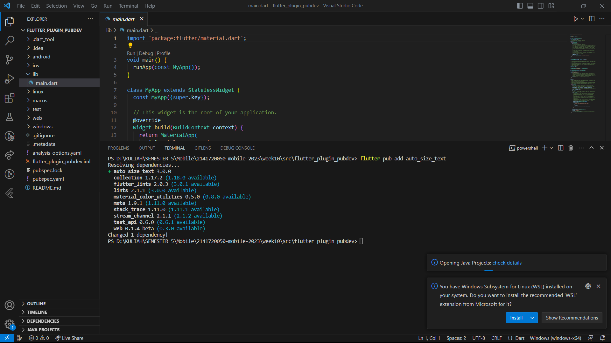
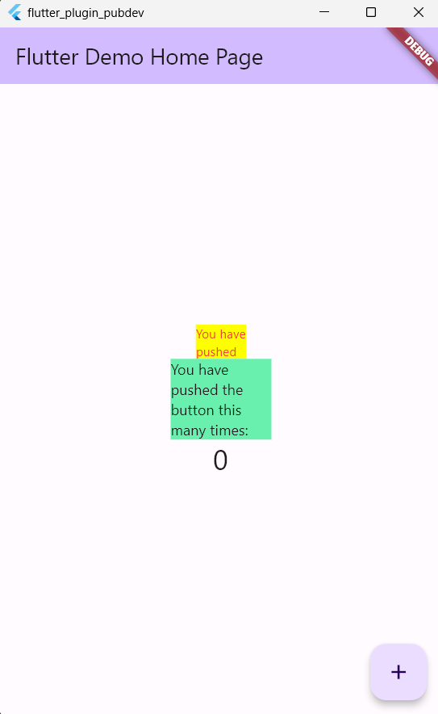

# **PRAKTIKUM 10 - MENERAPKAN PLUGIN PADA PROJECT FLUTTER**

### **Nama    : Novita Dwi Rahmadani**

### **Kelas   : TI-3F**

### **NIM     : 2141720050**

==============================================

**Menambahkan Plugin**

**Output**

### **Tugas**
1. Selesaikan Praktikum tersebut, lalu dokumentasikan dan push ke repository Anda berupa screenshot hasil pekerjaan beserta penjelasannya di file README.md!
2. Jelaskan maksud dari langkah 2 pada praktikum tersebut!
Jawab :
Langkah 2 yaitu menambahkan plugin auto_size_text pada project yang dibuat. Plugin auto_size_text adalah sebuah paket Flutter yang menyediakan widget AutoSizeText. Widget ini memungkinkan teks untuk secara otomatis menyesuaikan ukurannya agar sesuai dengan ruang yang tersedia.Dengan menggunakan AutoSizeText, tidak perlu secara manual menentukan ukuran teks atau memikirkan tentang overflow atau potongannya
3. Jelaskan maksud dari langkah 5 pada praktikum tersebut!
Jawab :
Langkah 5 bertujuan untuk menambahkan variabel bernama text yang nantinya akan digunakan sebagai parameter apabila function RedTextWidget dipanggil dan paremeter text bersifat required yang artinya wajib diisikan apabila memanggil function RedTextWidget.
4. Pada langkah 6 terdapat dua widget yang ditambahkan, jelaskan fungsi dan perbedaannya!
Jawab :
`RedTextWidget` adalah suatu jenis widget kustom yang Anda buat di dalam Flutter. Fungsi `build` di dalamnya menentukan tampilan atau tata letak dari widget tersebut. Widget itu sendiri adalah elemen dasar yang membentuk antarmuka pengguna dalam Flutter, seperti teks, gambar, dan tata letak. Fungsi `build` dipanggil oleh Flutter untuk merender atau menampilkan widget di layar. Jadi, `RedTextWidget` adalah aturan khusus tentang bagaimana teks berwarna merah ditampilkan di aplikasi Flutter Anda.
5. Jelaskan maksud dari tiap parameter yang ada di dalam plugin auto_size_text berdasarkan tautan pada dokumentasi ini !
Jawab :

    * key: Parameter ini digunakan untuk memberikan kunci (key) unik kepada widget. Kunci ini dapat membantu dalam mengidentifikasi dan memanipulasi widget secara spesifik.
    * textKey: Jika Anda ingin membuat animasi yang memanipulasi ukuran teks, Anda dapat menggunakan parameter textKey untuk memberikan kunci (key) kepada teks yang akan diubah ukurannya.
    * style: Parameter ini digunakan untuk menentukan gaya teks seperti warna, ukuran font, dll.
    * minFontSize: Menentukan ukuran font minimum yang diperbolehkan.
    * maxFontSize: Menentukan ukuran font maksimum yang diperbolehkan.
    *stepGranularity: Menentukan seberapa halus penyesuaian ukuran font. Semakin kecil nilai ini, semakin halus penyesuaian ukuran fontnya.
    *presetFontSizes: Sebuah daftar dari ukuran font yang telah ditentukan sebelumnya. Widget akan memilih ukuran font terdekat dari daftar ini.
    *maxLines: Menentukan jumlah maksimum baris teks yang akan ditampilkan sebelum terjadi potongan (ellipsis).
    * softWrap: Menentukan apakah teks dapat membelah menjadi beberapa baris atau tidak.
    * textAlign: Menentukan cara teks akan diatur dalam widget, seperti rata kanan, rata kiri, atau tengah.
    * textDirection: Menentukan arah teks, seperti dari kiri ke kanan atau dari kanan ke kiri.
    * locale: Menentukan bahasa atau lokalitas untuk penataan teks.

