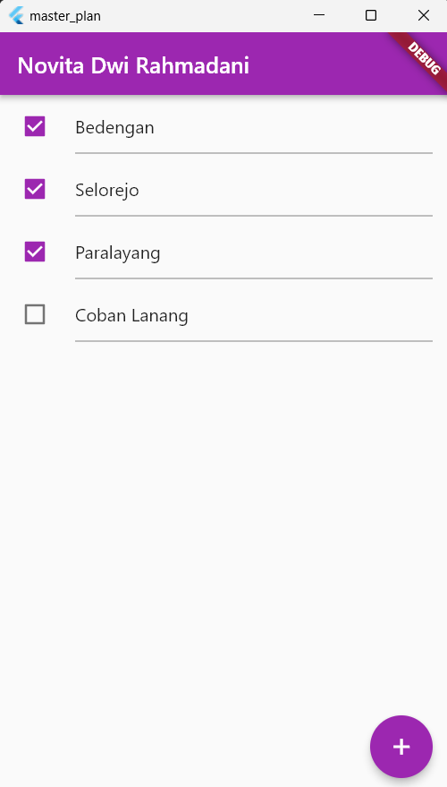
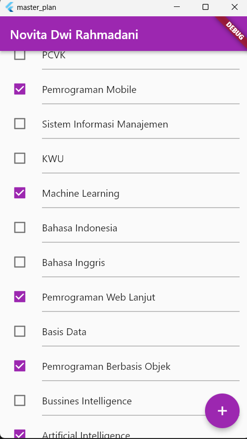
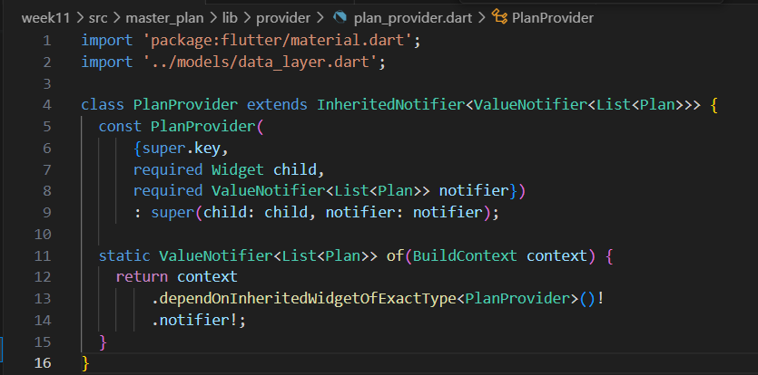
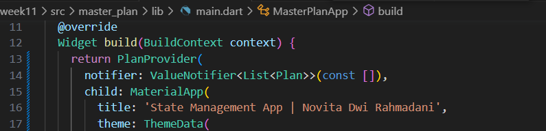
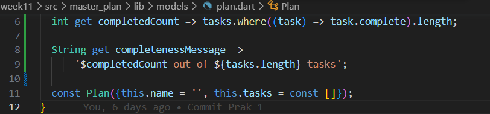
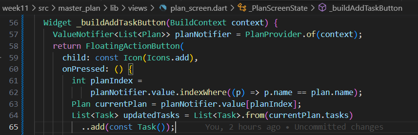
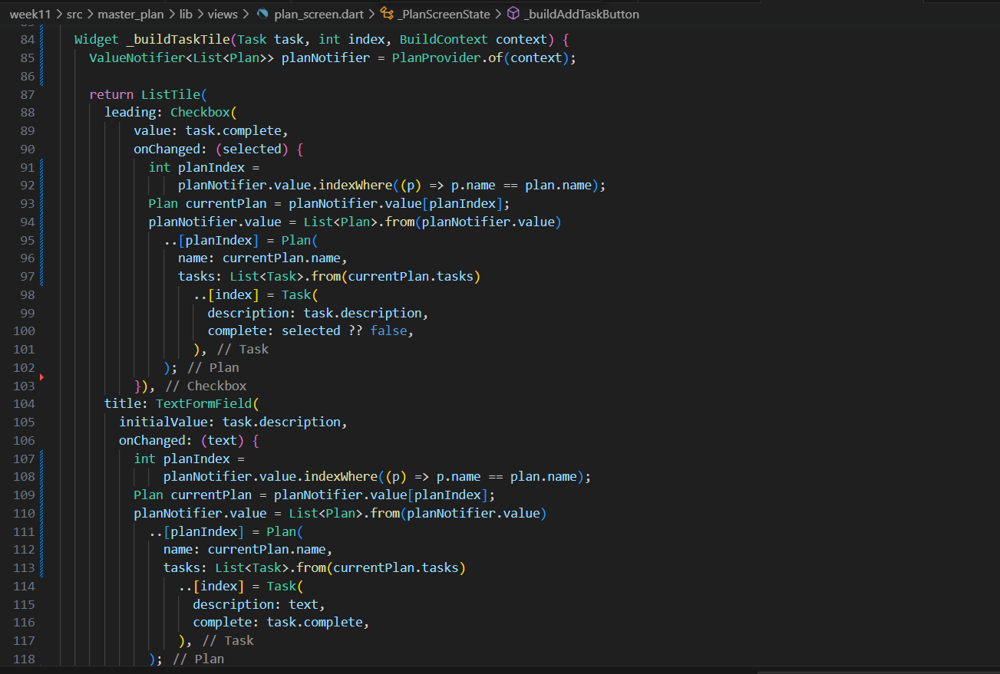
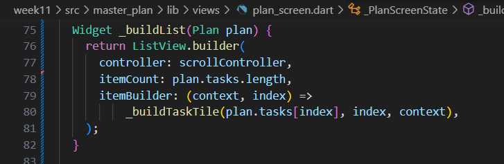
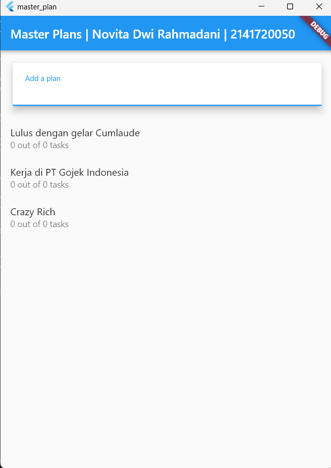
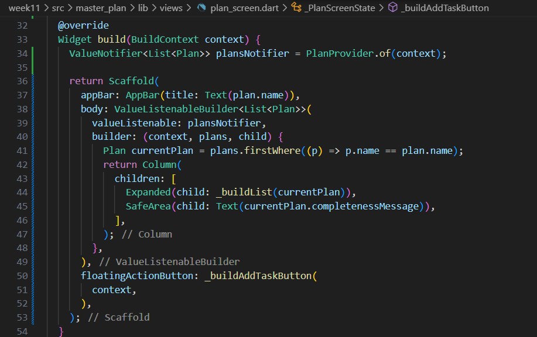

# **PRAKTIKUM 11 - MANAJEMEN STATE PADA FLUTTER**

### **Nama    : Novita Dwi Rahmadani**

### **Kelas   : TI-3F**

### **NIM     : 2141720050**

==============================================

## **Praktikum 1 - Dasar State dengen Model-View**

Hasil Capture Langkah 1-9 :

Output Praktikum 1 :

## **Tugas Praktikum 1**
1. Selesaikan langkah-langkah praktikum tersebut, lalu dokumentasikan berupa GIF hasil akhir praktikum beserta penjelasannya di file README.md!
2. Jelaskan maksud dari langkah 4 pada praktikum tersebut! Mengapa dilakukan demikian?
Jawab : Langkah 4 menyarankan untuk membuat file `data_layer.dart` di dalam folder `models` yang akan mengekspor model-model data. Ini membantu mengorganisir dan menyederhanakan proses impor data, serta mempermudah pemeliharaan dan pengembangan aplikasi.
3. Mengapa perlu variabel plan di langkah 6 pada praktikum tersebut? Mengapa dibuat konstanta ?
Jawab : Variabel `plan` yang didefinisikan dalam langkah 6 digunakan untuk menyimpan informasi atau data terkait dengan rencana atau tugas tertentu. Kata kunci `const` menunjukkan bahwa instance `Plan` adalah konstan atau tidak dapat diubah setelah dibuat. Ini memungkinkan widget `PlanScreen` untuk mengakses dan menggunakan data dari model `Plan` tersebut.
4. Lakukan capture hasil dari Langkah 9 berupa GIF, kemudian jelaskan apa yang telah Anda buat!
5. Apa kegunaan method pada Langkah 11 dan 13 dalam lifecyle state ?
* Langkah 11
Dalam initState(), membuat sebuah ScrollController yang akan memungkinkan mengontrol perilaku scroll di dalam widget ini. Kemudian, menambahkan listener pada controller ini. Setiap kali ada perubahan dalam scroll, Anda memanggil FocusScope.of(context).requestFocus(FocusNode()) untuk memastikan bahwa fokus keyboard dihapus, sehingga pengguna tidak dapat memasukkan teks saat scrolling.

* Langkah 13
Dalam dispose(), Anda memastikan untuk membebaskan sumber daya dengan memanggil scrollController.dispose(). Ini penting untuk mencegah kebocoran memori atau masalah lain yang terkait dengan penggunaan ScrollController.

6. Kumpulkan laporan praktikum Anda berupa link commit atau repository GitHub ke spreadsheet yang telah disediakan!

## **Praktikum 2 - Mengelola Data Layer dengan InheritedWidget dan InheritedNotifier**

Langkah 1 : Buat file plan_provider.dart

Langkah 2 : Edit main.dart

Langkah 3 : Tambah method pada model plan.dart

Langkah 4 : Pindah ke PlanScreen

Langkah 5 : Edit method _buildAddTaskButton

Langkah 6 : Edit method _buildTaskTile

Langkah 7 : Edit _buildList

Langkah 8 : Tetap di class PlanScreen

Langkah 9: Tambah widget SafeArea

Output Praktikum 1 :

## **Tugas Praktikum 2**

1. Selesaikan langkah-langkah praktikum tersebut, lalu dokumentasikan berupa GIF hasil akhir praktikum beserta penjelasannya di file README.md! Jika Anda menemukan ada yang error atau tidak berjalan dengan baik, silakan diperbaiki sesuai dengan tujuan aplikasi tersebut dibuat.
2. Jelaskan mana yang dimaksud InheritedWidget pada langkah 1 tersebut! Mengapa yang digunakan InheritedNotifier?
Jawab :
* InheritedWidget sendiri adalah widget yang dapat menyimpan data dan membuatnya dapat diakses oleh widget-widget di bawahnya dalam tree widget. Ini bekerja dengan prinsip pewarisan, di mana widget-widget anak dapat "mewarisi" data dari widget induknya.
* InheritedNotifier:
InheritedNotifier adalah turunan dari InheritedWidget yang digunakan untuk mengatur state yang dapat diubah (mutable). Dalam kasus ini, InheritedNotifier memiliki generic type ValueNotifier<Plan>. ValueNotifier sendiri adalah objek yang dapat mengirimkan notifikasi ketika nilainya berubah.

    Mengapa menggunakan InheritedNotifier?
* ValueNotifier memberikan cara untuk melacak perubahan nilai dan memberi tahu widget-widget yang menggunakannya ketika nilai berubah.
* InheritedNotifier memungkinkan nilai tersebut diwariskan ke bawah dalam widget tree, sehingga setiap widget yang bergantung pada nilai tersebut dapat diperbarui secara otomatis ketika nilainya berubah tanpa perlu melakukan pembaruan manual.
3. Jelaskan maksud dari method di langkah 3 pada praktikum tersebut! Mengapa dilakukan demikian?
Jawab :
Maksud dari method yang diberikan dalam langkah 3 adalah untuk memberikan informasi terkait sejauh mana tugas-tugas dalam suatu daftar telah diselesaikan. Dua method yang diberikan adalah completedCount dan completenessMessage.
* completedCount method:
Menghitung jumlah tugas yang telah diselesaikan.
Menggunakan metode where dan length.
* completenessMessage method:
Menghasilkan pesan tentang sejauh mana tugas-tugas telah diselesaikan.
Menggunakan nilai dari completedCount untuk pesan.
Memanfaatkan string interpolation untuk tampilan yang informatif.

    Tujuan:

    a. Pemisahan logika penghitungan dari tampilan.

    b. Memudahkan pemeliharaan dan keterbacaan kode.

    c. Kode yang dapat digunakan ulang jika diperlukan di tempat lain.

4. Lakukan capture hasil dari Langkah 9 berupa GIF, kemudian jelaskan apa yang telah Anda buat!
5. Kumpulkan laporan praktikum Anda berupa link commit atau repository GitHub ke spreadsheet yang telah disediakan!

## **Praktikum 3 - Membuat State di Multiple Screens**

