# **PRAKTIKUM 12 - PEMROGRAMAN ASYNCHRONOUS**

### **Nama    : Novita Dwi Rahmadani**

### **Kelas   : TI-3F**

### **NIM     : 2141720050**

==============================================

## **Praktikum 1 - Mengunduh Data dari Web Service (API)**

    Langkah 1 : Buat Project Baru
    Buatlah sebuah project flutter baru dengan nama books di folder src week-12 repository GitHub. Kemudian Tambahkan dependensi http dengan mengetik perintah berikut di terminal.
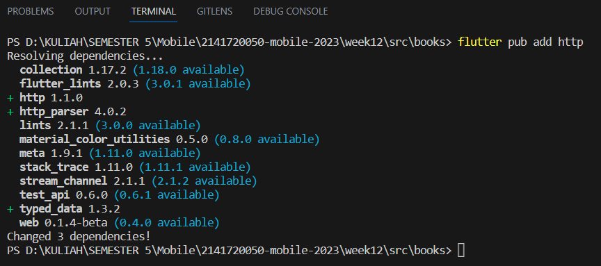

    Langkah 2 : Cek file pubspec.yaml
    Jika berhasil install plugin, pastikan plugin http telah ada di file pubspec ini seperti berikut.

    Langkah 3: Buka file main.dart
### **Soal 1** => Tambahkan nama panggilan Anda pada title app sebagai identitas hasil pekerjaan Anda.
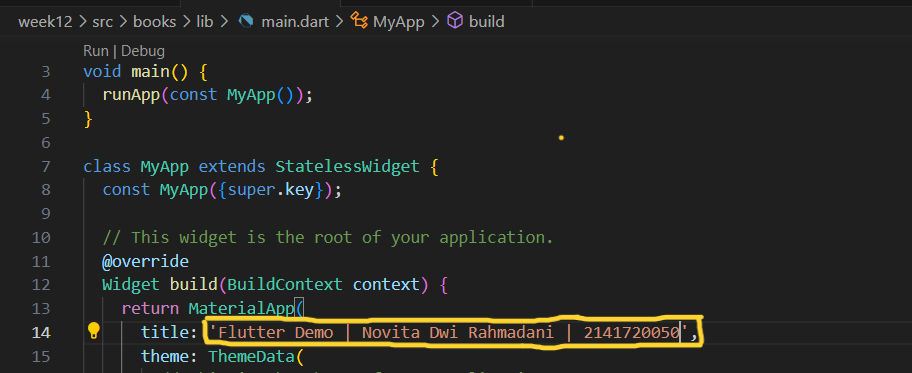

    Langkah 4: Tambah method getData()
    Tambahkan method ini ke dalam class _FuturePageState yang berguna untuk mengambil data dari API Google Books.
    c
### **Soal2** => Carilah judul buku favorit Anda di Google Books, lalu ganti ID buku pada variabel path di kode tersebut. 
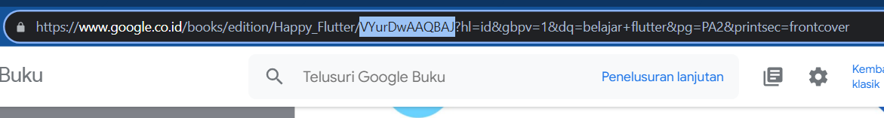
    Kemudian cobalah akses di browser URI tersebut dengan lengkap seperti ini. Jika menampilkan data JSON, maka Anda telah berhasil. Lakukan capture milik Anda dan tulis di README pada laporan praktikum. Lalu lakukan commit dengan pesan "W12: Soal 2".

    Langkah 5: Tambah kode di ElevatedButton
    Tambahkan kode pada onPressed di
    ElevatedButton seperti berikut.
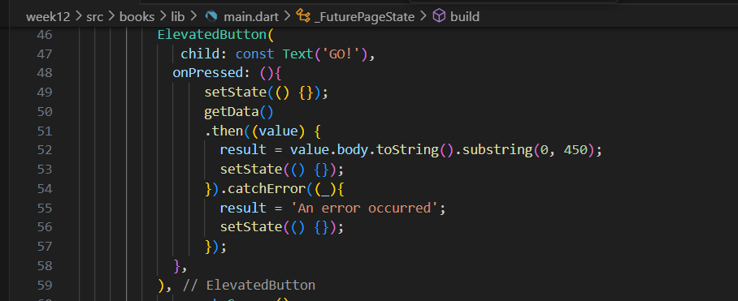

### **Soal 3 :** 
* Jelaskan maksud kode langkah 5 tersebut terkait substring dan catchError!
Jawab : 
substring(0, 450): Mengambil 450 karakter pertama dari respons data yang diperoleh dari fungsi getData dan menyimpannya dalam variabel result.
catchError((_){...}): Menangani kesalahan yang mungkin terjadi selama pengambilan data. Jika terjadi kesalahan, variabel result diatur menjadi 'An error occurred'.

* Capture hasil praktikum Anda berupa GIF dan lampirkan di README. Lalu lakukan commit dengan pesan "W12: Soal 3".
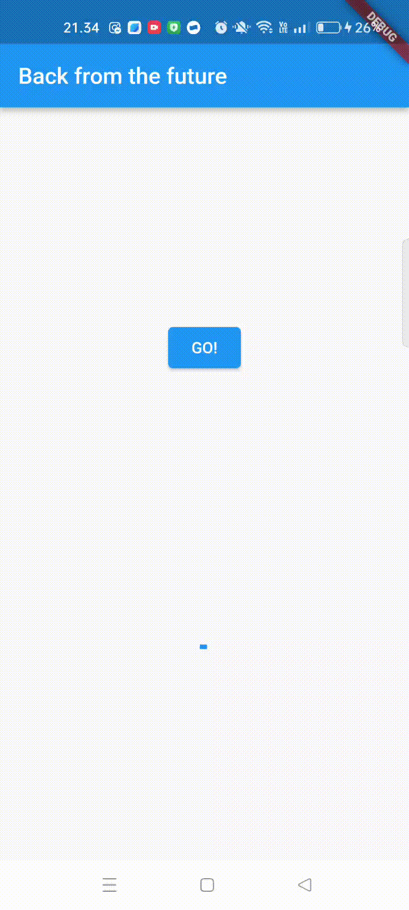

## **Praktikum 2 - Menggunakan await/async untuk menghindari callbacks**

    Langkah 1: Buka file main.dart
    Tambahkan tiga method berisi kode seperti berikut di dalam class _FuturePageState.
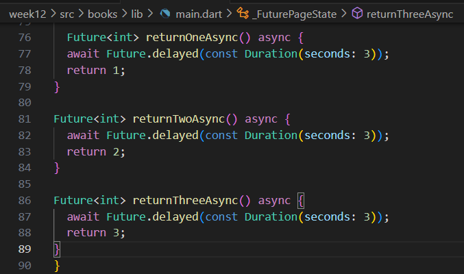

    Langkah 2: Tambah method count() 
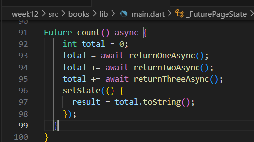

    Langkah 3: Panggil count()

    Langkah 4: Run
    Akhirnya, run atau tekan F5 jika aplikasi belum running. Maka Anda akan melihat seperti gambar berikut, hasil angka 6 akan tampil setelah delay 9 detik.
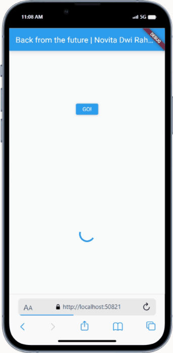

### **Soal 4 :**
* Jelaskan maksud kode langkah 1 dan 2 tersebut!
jawab :
Langkah 1 : Membuat tiga buah method yang akan mencetak angka 1, 2, 3 dengan waktu delay 3 detik pada setiap method.
Langkah 2 : Mendeklarasikan sebuah variabel total bertipe int yang diinisialisasi enol. Ketiga method yang dibuat pada langkah 1 dipanggil pada method count() dan memberikan nilai pada variabel total. Lalu nilai total tersebut akan dicetak menjadi String dan akan tampil setelah program dijalankan selama 9 detik.
* Capture hasil praktikum Anda berupa GIF dan lampirkan di README. Lalu lakukan commit dengan pesan "W12: Soal 4".

## **Praktikum 3 - Menggunakan Completer di Future**

    Langkah 1: Buka main.dart
    Pastikan telah impor package async berikut.

    Langkah 2: Tambahkan variabel dan method
    Tambahkan variabel late dan method di class _FuturePageState seperti ini.
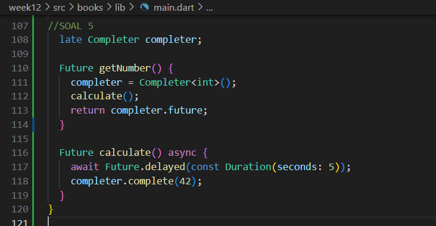

    Langkah 3: Ganti isi kode onPressed()
    Tambahkan kode berikut pada fungsi onPressed(). Kode sebelumnya bisa Anda comment.
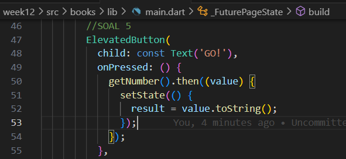

    Langkah 4:
    Terakhir, run atau tekan F5 untuk melihat hasilnya jika memang belum running. Bisa juga lakukan hot restart jika aplikasi sudah running. Maka hasilnya akan seperti gambar berikut ini. Setelah 5 detik, maka angka 42 akan tampil.

**Soal 5**
1. Jelaskan maksud kode langkah 2 tersebut!'
Jawab : Deklarasi pada kode program baris pertama berarti variabel completer yang bertipe late Completer akan diinisialisasi nanti sebelum digunakan. Hal ini memungkinkan pengguna menunggu hasil dari suatu operasi asinkronus. Selanjutnya untuk Function calculate merupakan Future asinkron yang akan menunda eksekusi selama 5 detik menggunakan future.delayed. Setelah penundaan selesai makan akan muncul angka 42 pada tampilan karena function getNumber() memanggil calculate.
2. Capture hasil praktikum Anda berupa GIF dan 3. lampirkan di README. Lalu lakukan commit dengan pesan "W12: Soal 5".

    Langkah 5: Ganti method calculate()
    Gantilah isi code method calculate() seperti kode berikut, atau Anda dapat membuat calculate2()
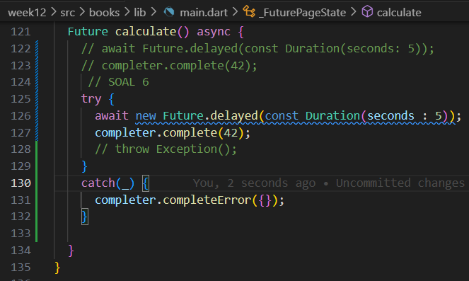

    Langkah 6: Pindah ke onPressed()
    Ganti menjadi kode seperti berikut.
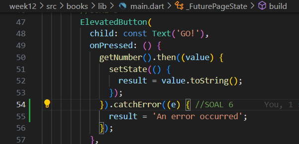

**Soal 6**
1. Jelaskan maksud perbedaan kode langkah 2 dengan langkah 5-6 tersebut!
Jawab : pada langkah kelima, perubahan dilakukan pada method calculate() di mana perubahan dilakukan pada bagian penanganan kesalahan. Sekarang, method ini menggunakan blok try-catch untuk mengelola proses asinkron. Saat proses yang tertunda dalam Future.delayed selesai, nilai 42 akan dikembalikan melalui completer.complete(42). Namun, jika terjadi kesalahan (error) selama penundaan, blok catch akan dieksekusi dan completer.completeError({}) digunakan untuk menandai bahwa terjadi kesalahan dengan mengembalikan objek kosong.
Sedangkan pada Langkah keenam mengubah bagian onPressed() di mana pemanggilan getNumber().then((value) {...}) dipindahkan ke dalam onPressed() dari tombol. Kemudian, penanganan kesalahan (error handling) ditambahkan dengan pemanggilan .catchError((e) {...}). Ketika future dari getNumber() menyelesaikan tugasnya, nilai yang diterima akan diubah menjadi string dan diperbarui ke dalam variabel result. Namun, jika ada kesalahan yang terjadi dalam proses tersebut, pesan 'An error occurred' akan disimpan dalam variabel result.

2. Capture hasil praktikum Anda berupa GIF dan lampirkan di README. Lalu 
Hasil dari kode program masih sama dengan sebelumnya karena dalam kode program tidak ditemukan error :

3. lakukan commit dengan pesan "W12: Soal 6".
