# **PRAKTIKUM 13 - State Management dengan Streams**

### **Nama    : Novita Dwi Rahmadani**

### **Kelas   : TI-3F**

### **NIM     : 2141720050**

==============================================

## **Praktikum 1 - Dart Streams**

    Langkah 1: Buat Project Baru
    Buatlah sebuah project flutter baru dengan nama stream_nama (beri nama panggilan Anda) di folder week-13/src/ repository GitHub Anda.

    Langkah 2: Buka file main.dart

### **Soal 1**
Tambahkan nama panggilan Anda pada title app sebagai identitas hasil pekerjaan Anda.
Gantilah warna tema aplikasi sesuai kesukaan Anda.
Lakukan commit hasil jawaban Soal 1 dengan pesan "W13: Jawaban Soal 1"

    Langkah 3: Buat file baru stream.dart

    Langkah 4: Tambah variabel colors
    Tambahkan variabel di dalam class ColorStream seperti berikut.

### **Soal 2**
* Tambahkan 5 warna lainnya sesuai keinginan Anda pada variabel colors tersebut.
* Lakukan commit hasil jawaban Soal 2 dengan pesan "W13: Jawaban Soal 2"

    Langkah 5: Tambah method getColors()
    Di dalam class ColorStream ketik method seperti kode berikut. Perhatikan tanda bintang di akhir keyword async* (ini digunakan untuk melakukan Stream data)
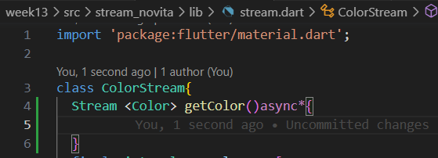

    Langkah 6: Tambah perintah yield*

### **Soal 3**
* Jelaskan fungsi keyword yield* pada kode tersebut!
Jawab : Penggunaan kata kunci yield* dalam suatu fungsi yang menghasilkan sebuah Stream.
yield*: Kata kunci yield* digunakan dalam fungsi generator untuk menghasilkan nilai dari suatu Iterable atau Stream. Dalam hal ini, yield* digunakan untuk menghasilkan nilai dari Stream.periodic.
Jadi, setiap kali Stream.periodic menghasilkan nilai (setiap detik), nilai tersebut "diteruskan" melalui generator menggunakan yield*. Ini memungkinkan nilai-nilai dari Stream tersebut masuk ke dalam aliran hasil fungsi generator. Perlu dicatat bahwa yield* digunakan pada fungsi generator untuk menghubungkan dua stream atau iterable, sehingga nilai-nilai yang dihasilkan oleh stream atau iterable sumber akan diteruskan ke dalam stream atau iterable hasil.

* Apa maksud isi perintah kode tersebut?
Jawab: Kode tersebut membuat dan mengembalikan suatu Stream yang menghasilkan nilai berdasarkan array colors setiap detik.

* Lakukan commit hasil jawaban Soal 3 dengan pesan "W13: Jawaban Soal 3"

    Langkah 7: Buka main.dart
    Ketik kode impor file ini pada file main.dart

    Langkah 8: Tambah variabel
    Ketik dua properti ini di dalam class _StreamHomePageState

    Langkah 9: Tambah method changeColor()
    Tetap di file main, Ketik kode seperti berikut

    Langkah 10: Lakukan override initState()

    Langkah 11: Ubah isi Scaffold()

    Langkah 12: Run

### **Soal 4**
* Capture hasil praktikum Anda berupa GIF dan lampirkan di README.
* Lakukan commit hasil jawaban Soal 4 dengan pesan "W13: Jawaban Soal 4"

    Langkah 13: Ganti isi method changeColor()

**Soal 5**
* Jelaskan perbedaan menggunakan listen dan await for (langkah 9) !
jawab :
1. await for:
await for digunakan untuk mengonsumsi data dari sebuah stream secara berurutan.
Dalam loop await for, setiap iterasi menunggu sampai elemen berikutnya tersedia di dalam stream sebelum melanjutkan ke iterasi berikutnya.
2. listen:
listen digunakan untuk mendaftarkan suatu fungsi yang akan dipanggil setiap kali ada elemen baru di dalam stream.
Dalam kasus ini, fungsi yang diberikan akan dipanggil setiap kali ada perubahan warna di dalam colorStream.
Kode di dalam fungsi listen akan dijalankan secara non-blocking, artinya eksekusi program tidak akan menunggu sampai semua elemen stream dikonsumsi.
* Lakukan commit hasil jawaban Soal 5 dengan pesan "W13: Jawaban Soal 5"

## **Praktikum 2 - Stream controllers dan sinks**

    Langkah 1: Buka file stream.dart
    Lakukan impor dengan mengetik kode ini.

    Langkah 2: Tambah class NumberStream
    Tetap di file stream.dart tambah class baru seperti berikut.

    Langkah 3: Tambah StreamController
    Di dalam class NumberStream buatlah variabel seperti berikut
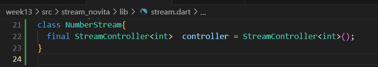

    Langkah 4: Tambah method addNumberToSink
    Tetap di class NumberStream buatlah method ini

    Langkah 5: Tambah method close()

    Langkah 6: Buka main.dart

    Langkah 7: Tambah variabel
    Di dalam class _StreamHomePageState ketik variabel berikut

    Langkah 8: Edit initState()

    Langkah 9: Edit dispose()
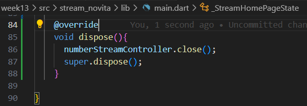

    Langkah 10: Tambah method addRandomNumber()

    Langkah 11: Edit method build()

    Langkah 12: Run

### **Soal 6**
* Jelaskan maksud kode langkah 8 dan 10 tersebut!
Jawab :
Maksud dari kode langkah 8 :
- Membuat instance dari NumberStream dan mendapatkan controller dari stream tersebut.
- Membuat listener pada stream untuk mendengarkan perubahan, dan ketika ada perubahan, memanggil setState untuk memperbarui state dan mengupdate lastNumber.
- Kode yang di-comment (// colorStream = ColorStream(); dan // changeColor();) sepertinya merupakan bagian yang dinonaktifkan (commented out) dan tidak dijalankan.

Maksud dari kode langkah 10 :
Kode tsb adalah sebuah fungsi yang menambahkan angka acak ke dalam numberStream. Poin utama dari kode ini adalah:
- Menggunakan Random untuk menghasilkan angka acak antara 0 dan 9.
- Memanggil addNumberToSink pada numberStream dengan angka acak yang telah dihasilkan sebagai argumen.

* Capture hasil praktikum Anda berupa GIF dan lampirkan di README.
* Lalu lakukan commit dengan pesan "W13: Jawaban Soal 6".

    Langkah 13: Buka stream.dart
    Tambahkan method berikut.

    Langkah 14: Buka main.dart
    Tambahkan method onError di dalam class StreamHomePageState pada method listen di fungsi initState() seperti berikut ini.

    Langkah 15: Edit method addRandomNumber()
    Lakukan comment pada dua baris kode berikut, lalu ketik kode seperti berikut ini.

**Soal 7**
1. Jelaskan maksud kode langkah 13 sampai 15 tersebut!
Jawab : 
    kode langkah 13 => Fungsi tersebut untuk menambahkan kesalahan ('Error') ke sink (saluran atau tujuan data) yang terkait dengan objek controller. Sink biasanya digunakan dalam pemrograman berbasis stream untuk mengirim data atau kesalahan ke aliran data tersebut.

    kode langkah 15 => Fungsi addRandomNumber membuat objek Random untuk menghasilkan bilangan acak. Namun, baris yang seharusnya menambahkan bilangan acak ke suatu stream (numberStream) telah di-comment (dihapus komentar), dan yang digunakan adalah pemanggilan fungsi addError dari stream tersebut. Oleh karena itu, fungsi ini tampaknya dirancang untuk menambahkan kesalahan ke stream (numberStream).
    Dan apabila program mengalami error maka akan memunculkan nilai -1 yang sudah diinisialisasikan pada variabel lastNumber.
2. Kembalikan kode seperti semula pada Langkah 15, comment addError() agar Anda dapat melanjutkan ke praktikum 3 berikutnya.
3. Lalu lakukan commit dengan pesan "W13: Jawaban Soal 7".

    Tampilan : 

## **Praktikum 3 - Injeksi data ke streams**

    Langkah 1 : Buka main.dart
    Tambahkan variabel baru di dalam class _StreamHomePageState
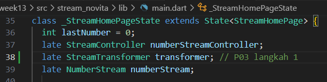

    Langkah 2 : Tambahkan kode ini di initState
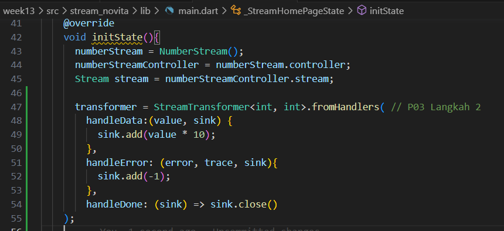

    Langkah 3: Tetap di initState
    Lakukan edit 

    Langkah 4: Run
    Terakhir, run atau tekan F5 untuk melihat hasilnya jika memang belum running. Bisa juga lakukan hot restart jika aplikasi sudah running. Maka hasilnya akan seperti gambar berikut ini. Anda akan melihat tampilan angka dari 0 hingga 90.

**Soal 8**
1. Jelaskan maksud kode langkah 1-3 tersebut!
    Jawaban :
    * Pada langkah 1 membuat variabel transform bertipe late StreamTransformer
    * Pada langkah 2 dilakukan inisialisasi variabel stream dengan menerapkan sink. handleData digunakan untuk menambahkan data dalam stream dengan value * 10. Sedangkan handleError bertugas untuk menangani error dan akan mengembalikan value -1 apabila terjadi error. handleDone digunakan untuk menutup sink ketika sink selesai.
    * Pada langkah 3 dilakukan pemanggilan variabel transform yang telah diinisialisasi pada stream.listen((event){}).
2. Capture hasil praktikum Anda berupa GIF dan lampirkan di README.
3. Lalu lakukan commit dengan pesan "W13: Jawaban Soal 8".

### **Praktikum 4: Subscribe ke stream events**

    Langkah 1: Tambah variabel
    Tambahkan variabel 
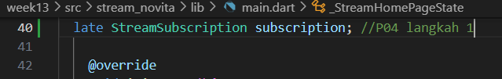

    Langkah 2: Edit initState()
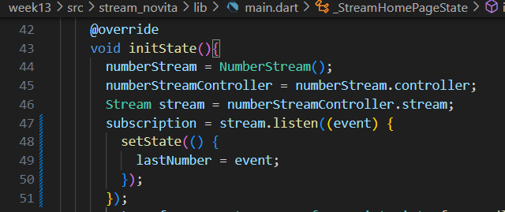

    Langkah 3: Tetap di initState()
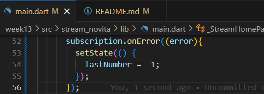

    Langkah 4: Tambah properti onDone()
    Tambahkan dibawahnya kode ini setelah onError
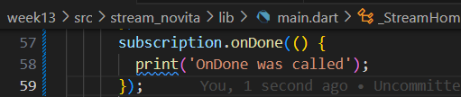

    Langkah 5: Tambah method baru
    Ketik method ini di dalam class _StreamHomePageState

    Langkah 6: Pindah ke method dispose()
    Jika method dispose() belum ada, Anda dapat mengetiknya dan dibuat override. Ketik kode ini didalamnya.
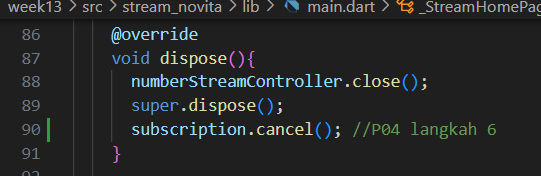

    Langkah 7: Pindah ke method build()
    Tambahkan button kedua dengan isi kode seperti berikut ini.
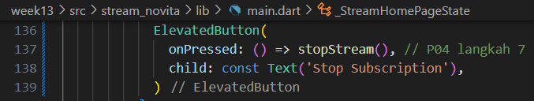

    Langkah 8: Edit method addRandomNumber()
    Edit kode seperti berikut ini.
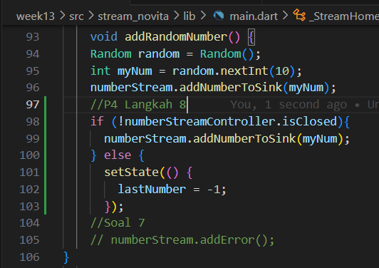

    Langkah 9: Run
    Anda akan melihat dua button seperti gambar berikut.
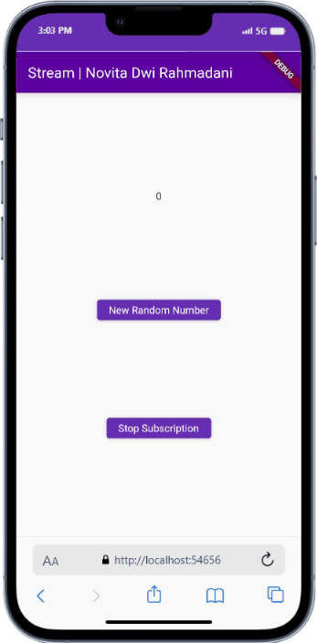

    Langkah 10: Tekan button ‘Stop Subscription'
    Anda akan melihat pesan di Debug Console seperti berikut.
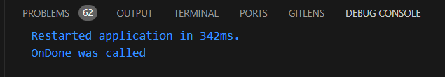

**Soal 9**
* Jelaskan maksud kode langkah 2, 6 dan 8 tersebut!
Jawab : 
- Langkah 2: Pada langkah 2, dilakukan pendaftaran `listener` pada `stream` menggunakan metode `listen`. Ketika ada data yang masuk ke `stream`, fungsi yang didefinisikan di dalam `listen` akan dijalankan. Dalam kasus ini, ketika ada perubahan pada `stream`, nilai terakhir (`lastNumber`) akan diperbarui menggunakan `setState`.

- Langkah 6: Pada langkah 6, terjadi pembatalan (`cancel`) pendaftaran `listener` yang telah dilakukan sebelumnya. Ini berarti pemberhentian pemantauan terhadap perubahan pada `stream`. Jika suatu waktu tidak diperlukan untuk mendengarkan perubahan lebih lanjut, langkah ini dapat digunakan untuk menghentikan pemantauan tersebut dan menghemat sumber daya.

- Langkah 8: Pada langkah 8, fungsi `addRandomNumber` bertujuan untuk menambahkan angka acak ke dalam `stream`. Langkah ini melibatkan pembuatan angka acak antara 0 dan 9 menggunakan `random.nextInt(10)`. Sebelum nilai ditambahkan ke `stream`, langkah ini memeriksa apakah `numberStreamController` (yang mungkin merepresentasikan `stream`) telah ditutup (`closed`). Jika belum ditutup, angka tersebut ditambahkan ke `stream` melalui `addNumberToSink`, tetapi jika sudah ditutup, nilai terakhir diatur ke -1 melalui `setState`.
* Capture hasil praktikum Anda berupa GIF dan lampirkan di README.
* Lalu lakukan commit dengan pesan "W13: Jawaban Soal 9".

### **Praktikum 5: Multiple stream subscriptions**

    Langkah 1 : Buka file main.dart
    Ketik variabel berikut di class _StreamHomePageState
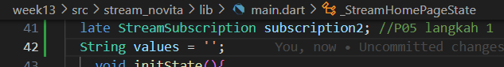

    Langkah 2 : Edit initState()
    Ketik kode seperti berikut.
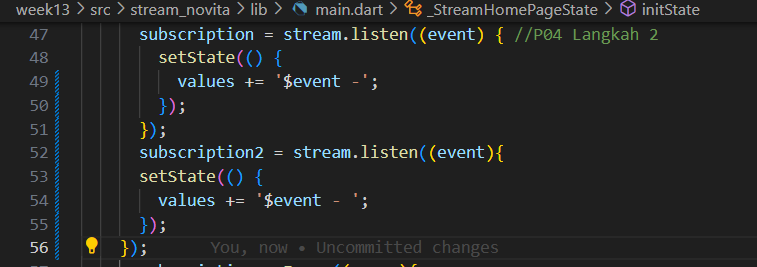

    Langkah 3 : Run

**Soal 10**
Jelaskan mengapa error itu bisa terjadi?
Jawab : Hal ini karena stream sudah dilakukan subscription sebelumnya. Pada umumnya satu stream hanya dapat dilakukan satu subscription, sedangkan pada penambahan kode program praktikum ini bermaksud untuk melakukan subscription yang kedua kalinya. Maka dari itu error bisa terjadi.

    Langkah 4: Set broadcast stream
    Ketik kode seperti berikut di method initState()

    Langkah 5: Edit method build()
    Tambahkan text seperti berikut.

    Langkah 6: Run
    Tekan button ‘New Random Number' beberapa kali, maka akan tampil teks angka terus bertambah sebanyak dua kali.

**Soal 11**
1. Jelaskan mengapa hal itu bisa terjadi ?
Jawab : Saat mengklik tombol "New Random Number", akan terjadi pengulangan angka acak yang identik. Angka-angka ini terhubung dengan sebuah stream yang dikenali oleh dua objek subscription, yakni subscription dan subscription2. Stream ini akan menghasilkan peristiwa (angka acak) yang dipisahkan oleh tanda "-". Ketika tombol "Stop Stream" ditekan, langganan terhadap stream akan dihentikan, sehingga stream tidak lagi menghasilkan output, meskipun tombol "New Random Number" masih ditekan.
2. Capture hasil praktikum Anda berupa GIF dan lampirkan di README.
3. Lalu lakukan commit dengan pesan "W13: Jawaban Soal 10,11".

