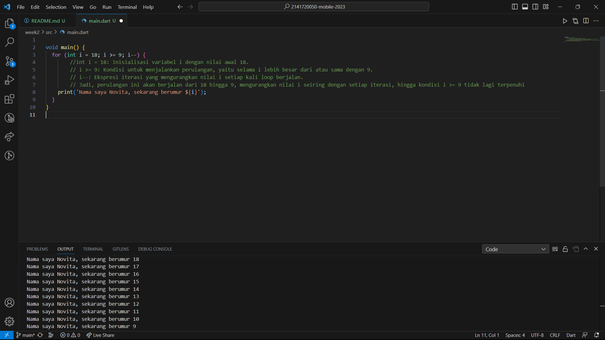
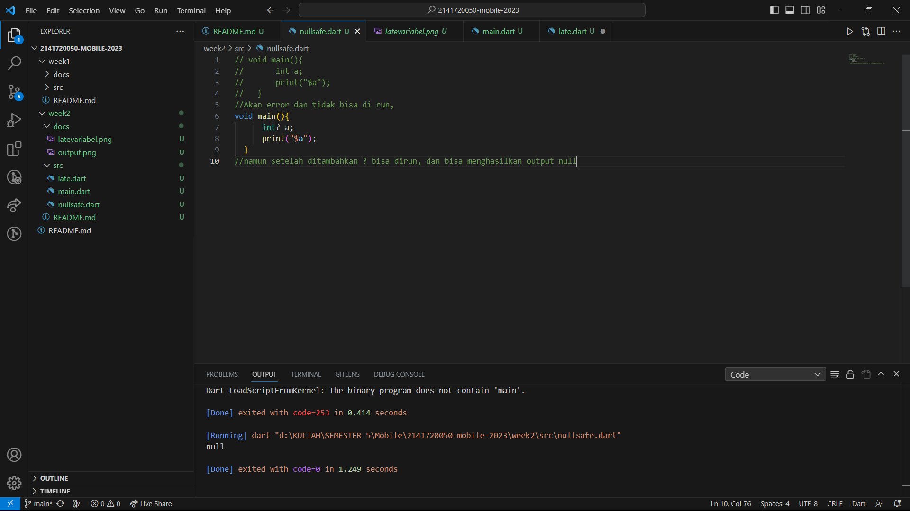
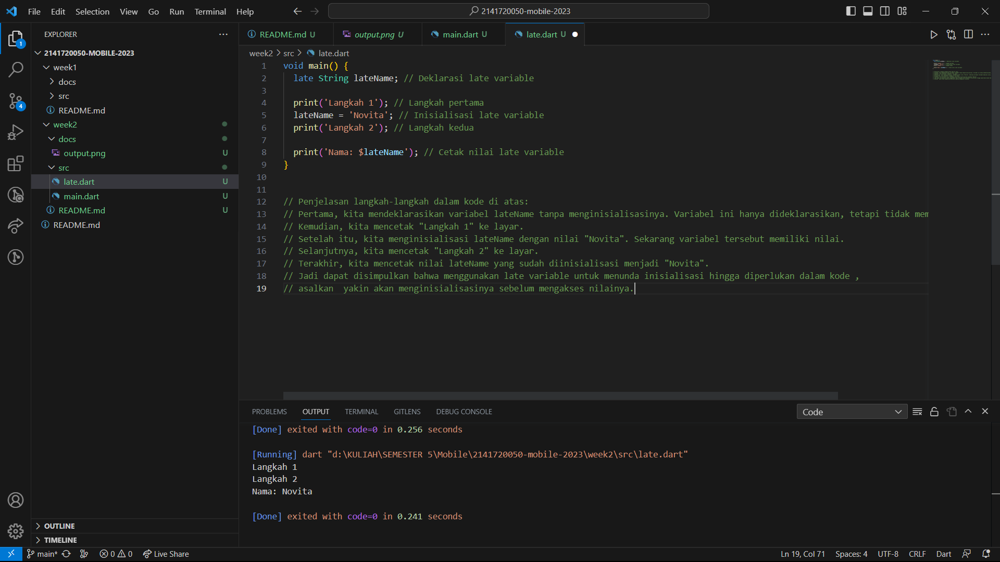

PERTEMUAN 2 

NIM : 2141720050

Nama : Novita Dwi Rahmadani

1. Tampilan Screenshoot Nomor 1

2. Memahami bahasa pemrograman Dart sebelum menggunakan framework Flutter sangat penting karena Dart adalah bahasa pemrograman yang digunakan secara eksklusif dalam pengembangan aplikasi Flutter. Dart memiliki konsep-konsep dasar seperti variabel, struktur pengendalian, tipe data, fungsi, dan objek yang harus dipahami sebelum menggunakan Flutter dengan baik.

3. Bahasa dart merupakan dasar fundamental dari framework flutter yang memiliki konsep dasar seperti variabel, struktur pengendalian, tipe data, fungsi dan objek. Dart bertujuan untuk menggabungkan kelebihan-kelebihan dari sebagian besar bahasa tingkat tinggi dengan fitur-fitur bahasa pemrograman terkini seperti productive fitur, garbage collection, ype annotations, statically typed, dan porbability.
Cara mengeksekusi kode dart dapat dilakukan dengan dua cara, seperti :
>Dart virtual machines (VMs)
>JavaScript compilations
Eksekusi kode Dart dapat beroperasi dalam dua mode — kompilasi Just-In-Time (JIT) atau Kompilasi Ahead-Of-Time (AOT)

Cara kerja dart :

    -Kode Sumber Dart: menulis program Dart dalam bentuk kode sumber, yang terdiri dari instruksi-instruksi yang akan dieksekusi oleh komputer. Kode sumber Dart biasanya disimpan dalam file dengan ekstensi .dart.

    -Kompilasi: Kode sumber Dart tidak dapat dieksekusi langsung oleh komputer. Sebelum dapat dijalankan, kode Dart harus dikompilasi menjadi kode bahasa mesin atau kode antara yang dapat dijalankan oleh Dart Virtual Machine (VM) atau JavaScript jika menggunakannya dalam pengembangan web.

    -Dart VM: Jika menjalankan kode Dart pada lingkungan yang mendukung Dart VM (seperti dalam pengembangan perangkat seluler dengan Flutter atau aplikasi konsol), Dart VM akan mengambil kode yang telah dikompilasi dan menjalankannya. Dart VM memastikan bahwa instruksi-instruksi dalam kode Dart dijalankan dengan benar sesuai dengan logika programnya.

    -Transpilasi ke JavaScript: Jika mengembangkan aplikasi web dengan Dart, maka kode Dart akan diubah menjadi kode JavaScript. Ini dilakukan dengan bantuan alat seperti Dart2JS. Kemudian, browser dapat menjalankan kode JavaScript ini untuk membuat aplikasi web berfungsi.

    -Paket dan Pustaka: Dart memiliki ekosistem paket dan pustaka yang luas. dapat mengimpor paket dan pustaka eksternal untuk memperluas fungsionalitas aplikasi. Misalnya, dalam pengembangan Flutter, akan mengimpor paket-paket yang berisi widget dan alat-alat yang berguna untuk membangun antarmuka pengguna.

    -Null Safety: Dart memiliki fitur Null Safety yang membantu mengelola nilai null dengan lebih aman. harus secara eksplisit mendefinisikan apakah suatu variabel dapat berisi null atau tidak.

    -Asinkron: Dart mendukung pemrograman asinkron dengan menggunakan Future dan async/await. Ini memungkinkan untuk mengelola tugas-tugas yang membutuhkan waktu tanpa menghalangi eksekusi program secara keseluruhan.

    -Pengelolaan Memori: Dart memiliki sistem pengelolaan memori yang canggih. Ini memungkinkan untuk mengalokasikan dan menghapus memori secara otomatis, mengurangi risiko kebocoran memori.

4. Tugas Kelompok 
Anggota :
1) Nasyawa Ramadhia Kirana S E (2141720011)
2) Novita Dwi Rahmadani        (2141720050)

Link PPT : https://docs.google.com/presentation/d/10twQwvieYzOkzUaktsHMcGNGH2-qkeOwf-6lQTg3ZEs/edit?usp=sharing

Eksekusi Kode Null Safety

Eksekusi Kode Late Variabel

