**Pemrograman Mobile Petermuan 3**
**Nama    : Novita Dwi Rahmadani**
**NIM     : 2141720050**

**Praktikum 1 : Menerapkan Control Flows("if/else")**
    1. Langkah 1
    output : terjadi erorr karena tidak ada fungsi "main" yang diawali dengan "void" dalam program Dart. 
    Output:
    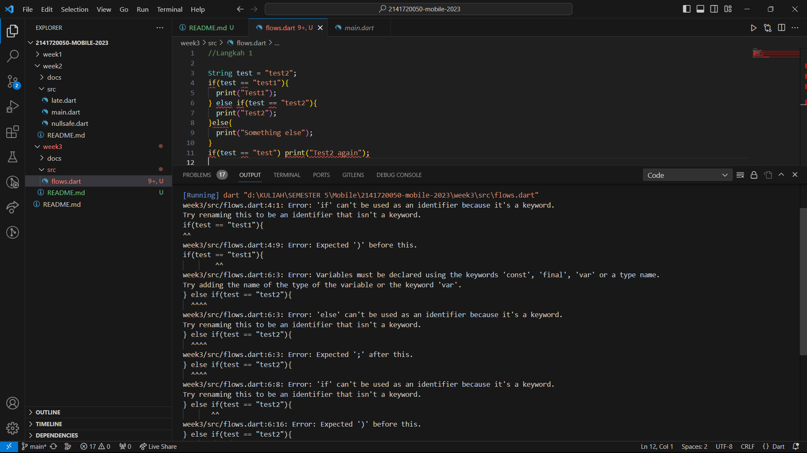

    2. Langkah 2 
    eksekusi dan perbaikan error
    Perbaikan : 

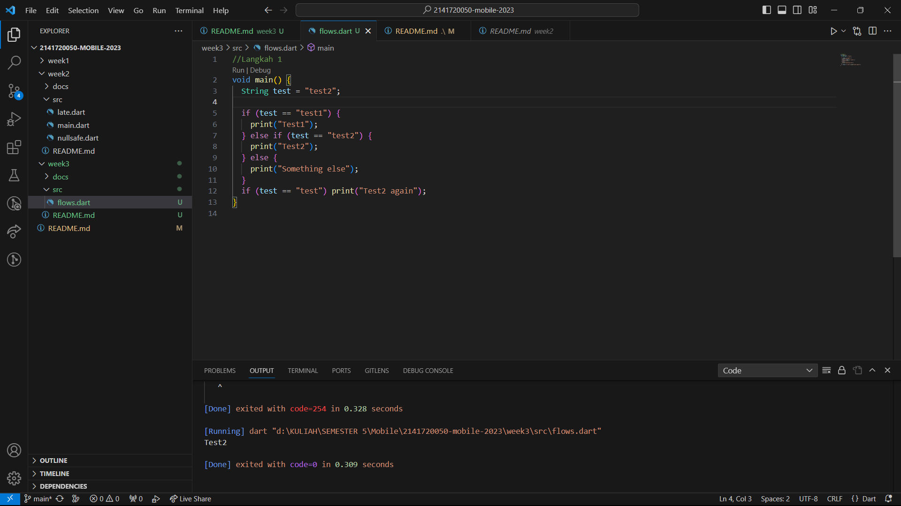

    3. Langkah 3 
    Menambahkan kode program dengan variabel tees bertipe data tes dan memiliki satu kondisi jika benar maka akan menampilkan "Kebenaran"
    Output

    Penjelasan : Terjadi error, karena beberapa faktor:
    -error pertama (week3/src/flows.dart:4:10) mengatakan bahwa variabel test sudah dideklarasikan sebelumnya dalam cakupan yang sama
    -error kedua (week3/src/flows.dart:5:7) mengatakan bahwa mencoba mengassign sebuah nilai dari tipe String (variabel test) ke variabel tipe bool dalam kondisi if. Kondisi dalam if harus berupa nilai boolean (true atau false), sedangkan test adalah string, sehingga perbandingannya tidak valid.
    -error ketiga  mencoba menggunakan variabel test yang memiliki tipe data String sebagai kondisi dalam sebuah pernyataan if. Namun, dalam pernyataan if, kondisi harus memiliki tipe data bool (true atau false), bukan String

    revisi kode:
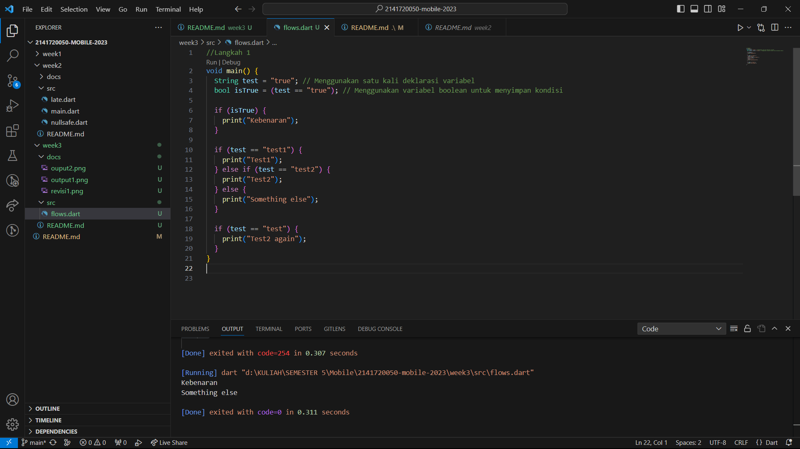

**Praktikum 2 : Perulangan while dan do-while**
    1. Langkah 1 
    Menambahkan kode ke dalam fungsi main() dengan sebuah kondisi perulangan while jika counter kurang dari 33 maka akan mencetak counter dan akan bertambah.
    2. Langkah 2
    Eksekusi kode pada langkah 1
    output :
 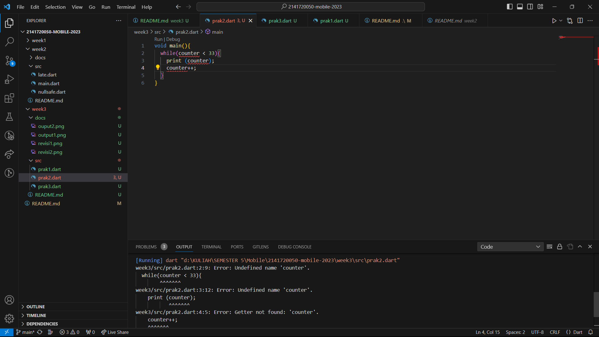
     Penjelasan :Terjadi error, karena variabel counter belum di deklarasikan atau di inisialisasi sebelum digunakan dalam perulangan while. 

     revisi kode :
 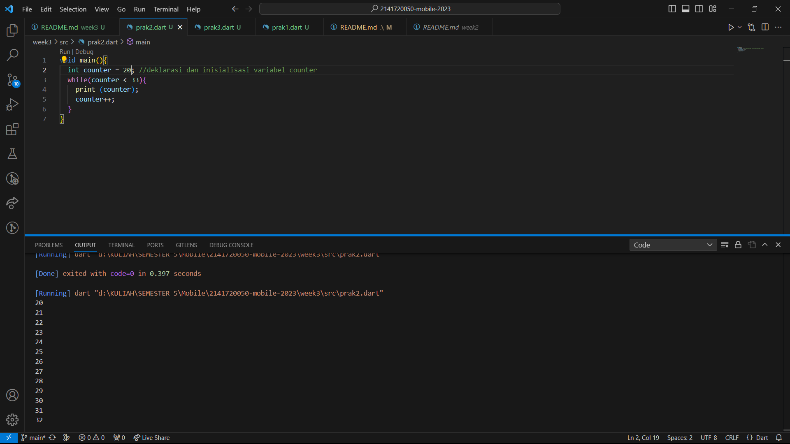

    3. Langkah 3
    Menambahkan kode dengan kondisi perulangan do-while 
    Output :
 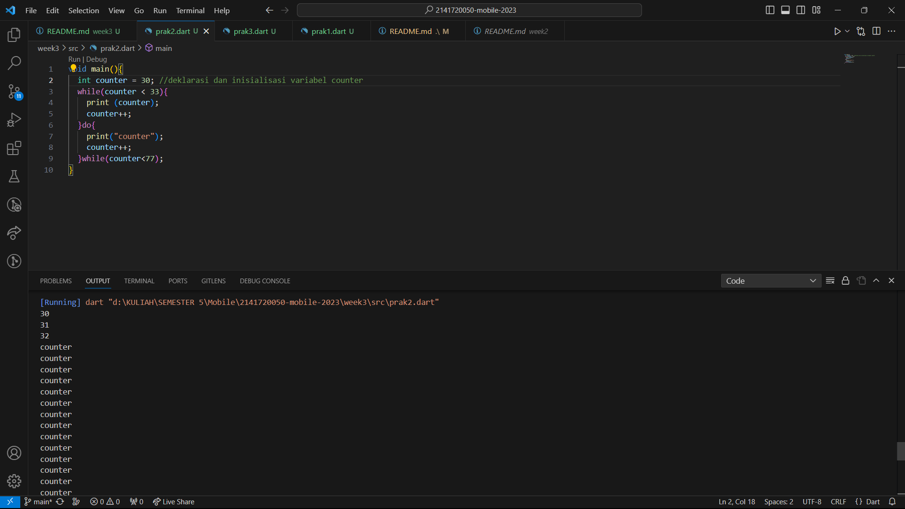
    Penjelasan : Menampilkan hasil dari kondisi perulangan while do-while dimana nilai counter yg didekalrasikan adalah '30'. Dan kondisi dari perulangan tsb, jk=ika nilai counter kurang dari '33' maka nilai counter akan dicetak menggunakan 'print' dan kemudian nilai 'çounter' akan diinkementasi(ditambah 1). Setelah perulangan 'while pertama selesai, program memasuki perulangan 'do-while'. pada blok 'do'teks 'counter' akan dicetak dan akan diinkrementasi. Setelah itu prohram memerika kondisi perulangan 'while', yang akan mengecek apakah 'counter' massih kurang dari '77'. Jika benar, maka program akan mebali ke blok 'do' dan mengulangi sampai kondisi tidak terpenuhi (nilai counter lebih dari atau sama dengan 77), dan saat itu program akan keluar dari perulangan do-while.

**Praktikum 3 : Menerapkan Perulangan "for" dan "break-continue"**
    1. Langkah 1
    Menambahkan kode program for ke dalam fungsi main 
    2. Langkah 2
    Eksekusi kode dan revisi
    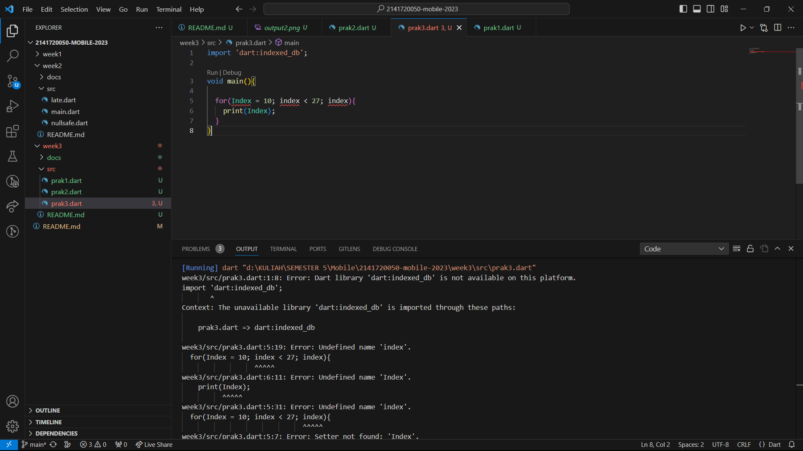
    Penjelasan : Terjadi error karena terdapat kesalahan dalam sintaksis dan penggunaan variabel 'index' yg tidak dideklarasikan sebelumnya. dan penulisan index disitu kurang tepat dg menggunakan huruf kapital di awal yang seharusnya huruf kecil. Selain itu juga ada kesalahan yang tidak mengikrementasikan nilai yang kurang menambahkan operator ++ setalah melewati kondisi jika index kurang dari 27 maka diberikan operator inkrement untuk menambahkan nilai pada index.

    revisi :
 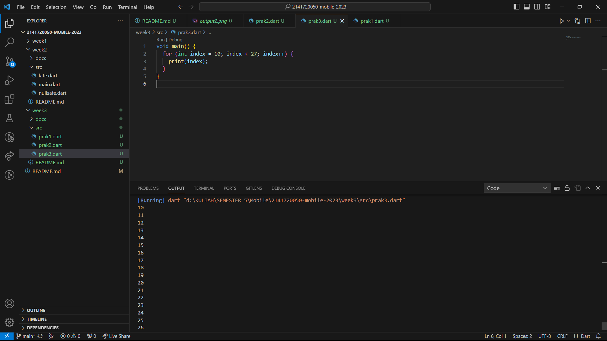

    3. Langkah 3
    Menambahkan kode pada forloop
    Output :
 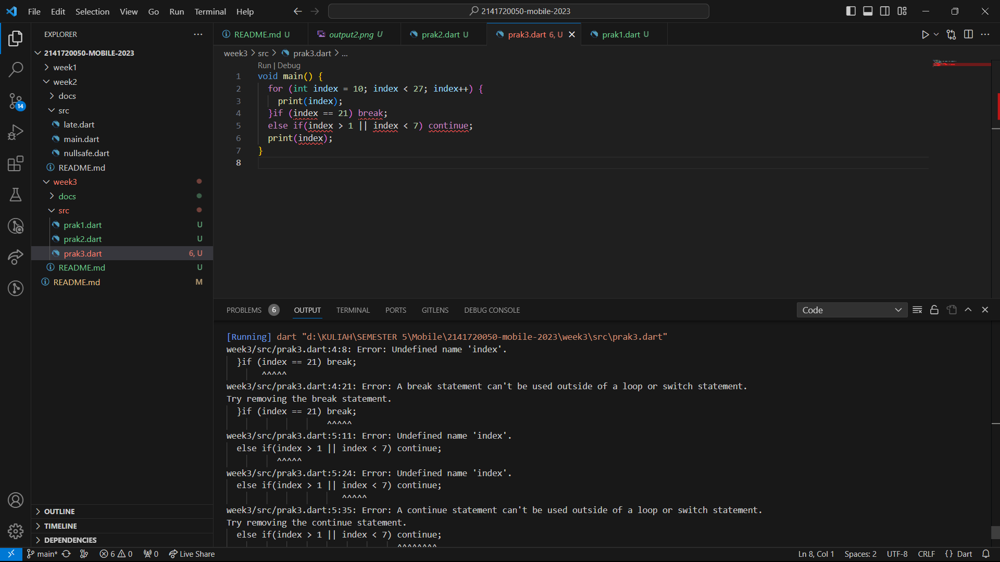    
    Penjelasan : terjadi error karena penulisan 'if' dan 'else if' tidak sepenuhnya menggunakan kapital, tidak menggunakan tanda kurung kurawal{} untuk mengelompokkan b;lok kode, pebulisan variabel yang salah dan pengondisian yang salah pada 'else if'

    revisi kode:
 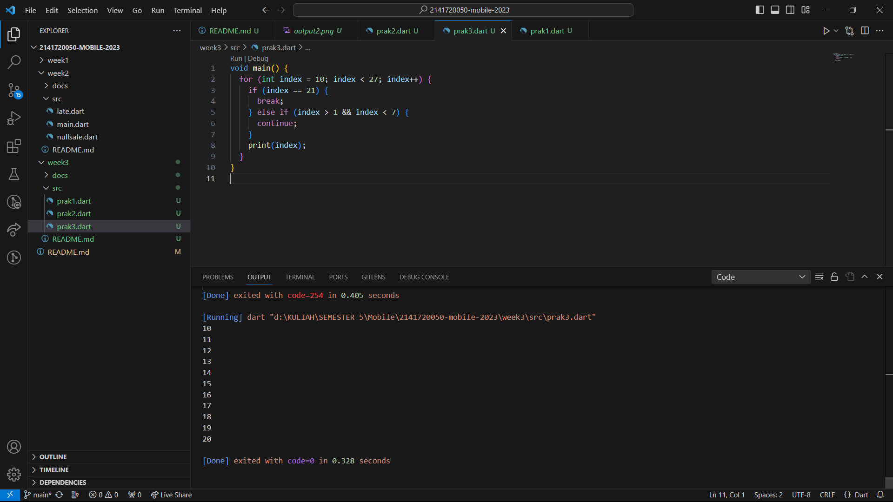  
    

**Tugas Praktikum**

1. Buatlah sebuah program yang dapat menampilkan bilangan prima dari angka 0 sampai 201 menggunakan Dart. Ketika bilangan prima ditemukan, maka tampilkan nama lengkap dan NIM Anda.
    ->Tampilan memunculkan bilangan prima
    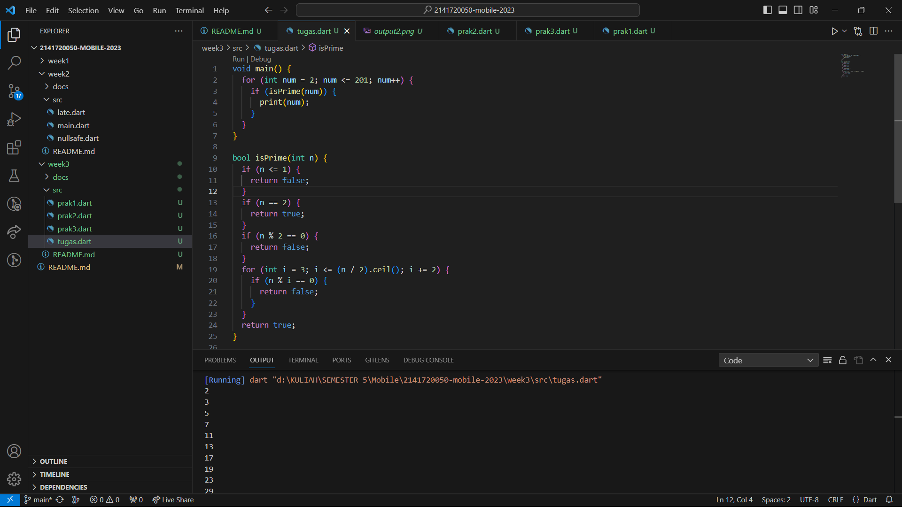
    Penjelasan : untuk menampilkan bilangan prima menggunakan perulangan forloop. for digunakan untuk mengiterasi angka dari 2 hingga 201. Di setiap iterai, program memanggil "isPrime()" untuk memerikasa apakah angka tsb adalah bilangan prima atau bukan. Program kemudian melakukan loop untuk memeriksa apakah angka tersebut dapat dibagi oleh angka lain, Jika angka dapat dibagi oleh angka lain selain 1 dan dirinya sendiri, maka dianggap bukan bilangan prima.
    ->Tampilan nama lengkap dan NIM
    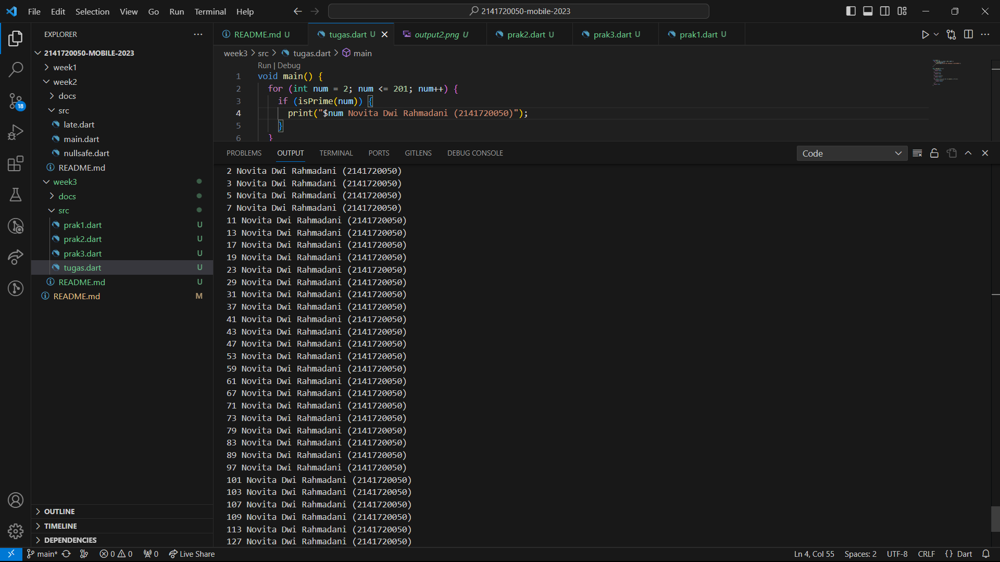
    

    

    

