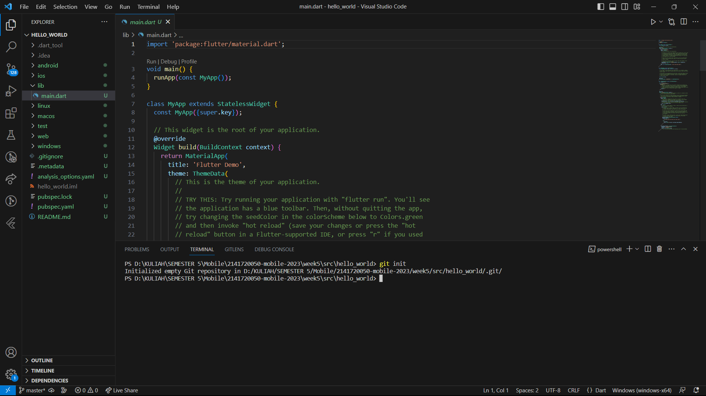

**PRAKTIKUM PERTEMUAN 5 --> FLUTTTER FUNDAMENTAL**

**Nama    : Novita Dwi Rahmadani**
**Kelas   : TI-3F**
**NIM     : 2141720050**

**Praktikum - Bagian 1 (Membuat Project Flutter Baru)**
    1. Langkah 1 : Buka VS Code, lalu tekan tombol Ctrl + Shift + P maka akan tampil Command Palette, lalu ketik Flutter. Pilih New Application Project.
    

    2. Langkah 2 :Kemudian buat folder sesuai style laporan praktikum yang Anda pilih. Disarankan pada folder dokumen atau desktop atau alamat folder lain yang tidak terlalu dalam atau panjang. Lalu pilih Select a folder to create the project in.

    3. Langkah 3 : Buat nama project flutter hello_world seperti berikut, lalu tekan Enter. Tunggu hingga proses pembuatan project baru selesai.
 

    4. Langkah 4 : Jika sudah selesai proses pembuatan project baru, pastikan tampilan seperti berikut. Pesan akan tampil berupa "Your Flutter Project is ready!" artinya Anda telah berhasil membuat project Flutter baru.
 

**Praktikum - Bagian 2 (Membuat Repository GitHub dan Laporan Praktikum)**

    1. Langkah 1 dan 2 sudah membuat repository.

    3. Langkah 3 : buka terminal pada menu Terminal > New Terminal. Lalu ketik perintah berikut untuk inisialisasi git pada project Anda.
 
    
    4. Langkah 4 : Pilih menu Source Control di bagian kiri, lalu lakukan stages (+) pada file .gitignore untuk mengunggah file pertama ke repository GitHub.

**Praktikum - Bagian 3 (Menerapkan Widget Dasar)** 

**Praktikum - Bagian 4 (Menerapkan Widget Material Design dan iOS Cupertino)** 
