# PRAKTIKUM PERTEMUAN 7 - LAYOUT DAN NAVIGASI

**Nama    : Novita Dwi Rahmadani**

**Kelas   : TI- 3F**

**NIM     : 21720050**

===================================================

## Praktikum 1: Membangun Layout Flutter
**Langkah 1 :** Membuat project baru dengan nama layout_flutter

**Langkah 2 :** Mengisi nama dan nim pada text title

**Langkah 3 :** Mengidentifikasi layout diagram

**Langkah 4 :** Mengimplementasikan title row

**Soal 1**

Kode Program 

Penjelasan :
Kode tersebut mendefinisikan tata letak dari elemen di dalam widget Column dalam Flutter. Properti crossAxisAlignment diatur sebagai CrossAxisAlignment.start, yang berarti elemen-elemen dalam kolom akan disusun secara horizontal dengan menyamakan sisi sebelah kiri dari setiap elemen. Dengan kata lain, elemen-elemen dalam kolom akan mulai dari sebelah kiri dan berlanjut ke kanan.

**Soal 2**

Kode Program :
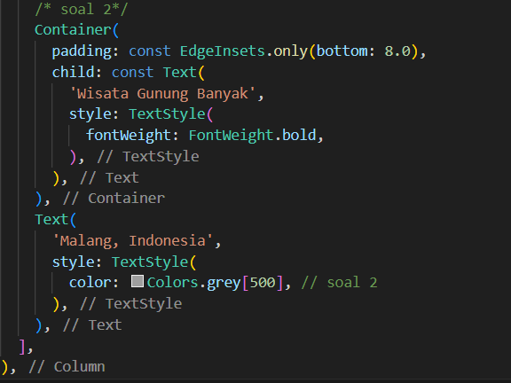
Penjelasan : 
Kode di atas adalah bagian dari tata letak (layout) Flutter yang menggunakan widget `Container`. Di dalam `Container`, terdapat dua widget `Text` berturut-turut. Yang pertama memiliki teks "Wisata Bendungan Selorejo" dengan gaya teks tebal, sedangkan yang kedua memiliki teks "Malang, Indonesia" dengan warna teks abu-abu. Penambahan `padding` pada `Container` memberikan jarak 8.0 piksel di bagian bawah widget. Kode ini digunakan untuk menampilkan dua elemen teks dalam UI, di mana yang pertama merupakan judul dan yang kedua adalah keterangan lokasi.

**Soal 3**

Kode Program:
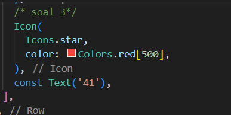
Penjelasan:
nambahkan icon star dengan warna merah dan sebuah text '41' serta melakukan pemanggilan titleSection pada widget build.

## Praktikum 2: Mengimplementasikan Button Row
Langkah 1 : Membuat method Column _buildButtonColumn
Program akan membuat sebuah kolom menggunakan sebuah metode bernama _buildButtonColumn yang memiliki tiga parameter bertipe Color, IconData, dam String. Di dalam method akan dilakukan penyesuaian ukuran kolom, alignment, icon, dan text.
Langkah 2 : Membuat Widget buttonSection
Program akan menampilkan ketiga ikon menggunakan sebuah method _buildButtonColumn. Kolom di sepanjang sumbu utama akan mengatur ruang kosong secara merata menggunaka kode program MainAxisAlignment.spaceEvenly. Langkah 3 : Menambah button section ke body

## Praktikum 3: Mengimplementasikan Text Section
Langkah 1 : Membuat Widget textSection
Program akan mencetak sebuah text dengan tambahan padding di sepanjang tepi text sejumlah 32.
Langkah 2 : Menambahkan Variabel Text Section ke Body

## Praktikum 3: Mengimplementasikan Text Section
Langkah 1 : Menyiapkan Aset Gambar
Melakukan pencarian gambar pada internet dan membuat folder images di root project layout_flutter. Setelah itu gambar yang sudah diunduh dimasukkan ke dalam folder images dan melakukan setting pada pubspec.yaml agar gambar dapat ditampilkan oleh program.
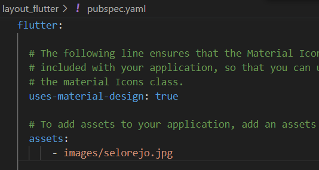

Langkah 2 : Menambahkan Gambar ke Body dan menjadi listview
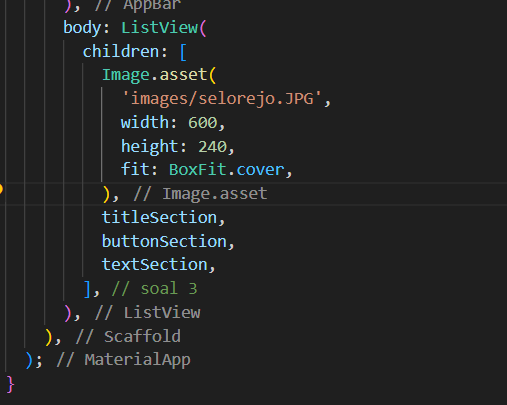

Hasil Kode Program :
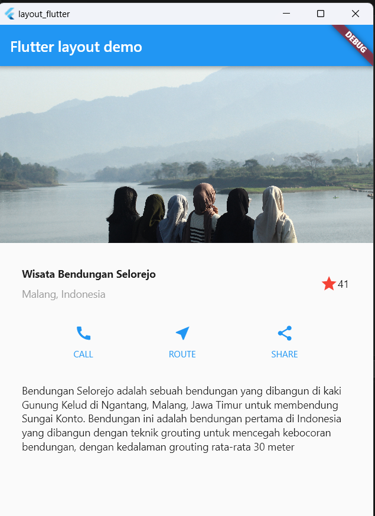

## Tugas Praktikum : Codelabs Flutter Layout
### Row and Comun Clases

1. Membuat folder baru di dalam folder lib dengan nama widget.
2. Membuat file dart baru di dalam folder widget dengan nama row_column.dart
3. Menambahkan kode program pada file row_column.dart
4. Melakukan import serta memanggil function RowColumnWidget di dalam function MyApp yang terletak pada main seperti berikut :
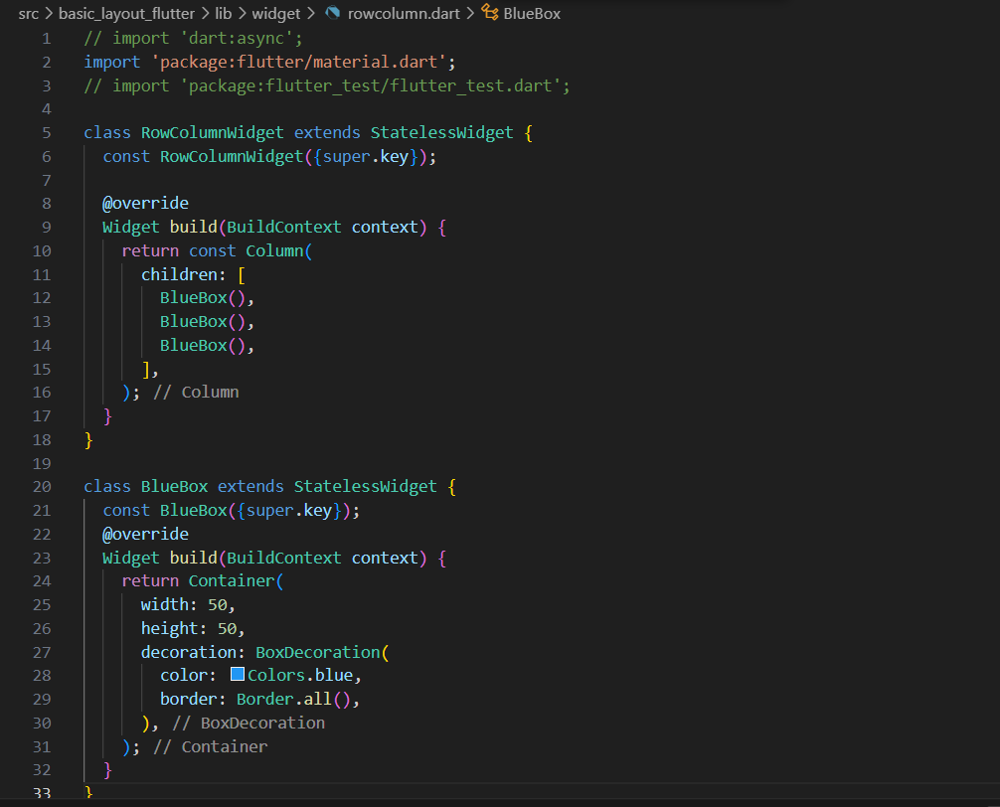
Hasil Kode Program :
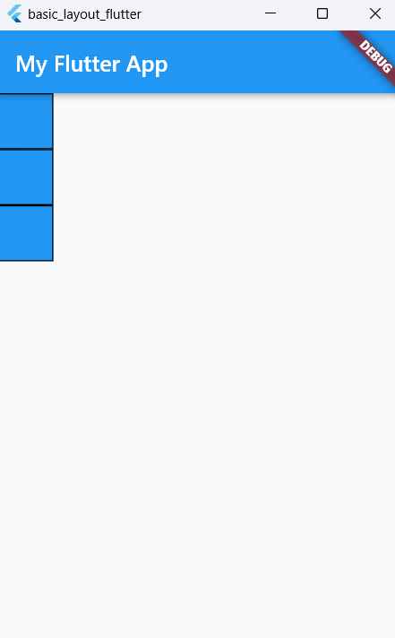

### Axis Size adn Aligment
1. Membuat file dart baru di dalam folder widget dengan nama main_axis.dart
2. Menambahkan kode program pada file main_axis.dart
3. Melakukan import serta memanggil function MainAxis di dalam function MyApp yang terletak pada main.
4. Hasil Run :
Baik menggunakan mainAxisSize.max atau mainAxisSize.min tampilan UI tidak terdapat perubahan.

5. Melakukan modifikasi pada file dart widget dengan menambahkan mainAxisAlignment: MainAxisAlignment.spaceAround dan crossAxisAlignment: CrossAxisAlignment.center, sehingga akan tampil seperti berikut :
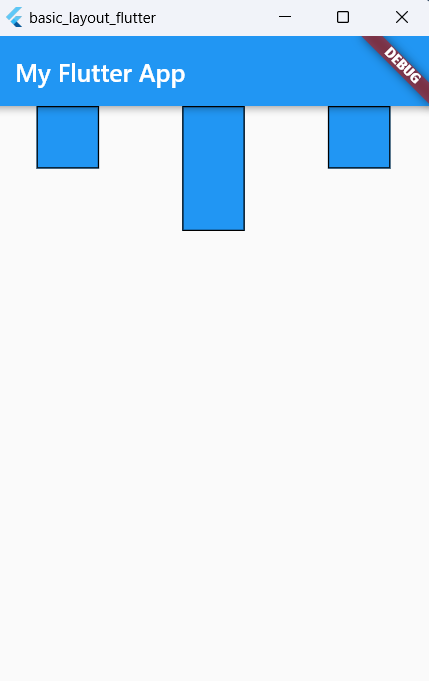

### Flexible Widget
1. Membuat file dart baru di dalam folder widget dengan nama flexibel.dart
2. Menambahkan kode program pada file flexibel.dart
3. Melakukan import serta memanggil function FlexibleWidget di dalam function MyApp yang terletak pada main.
Hasil run:
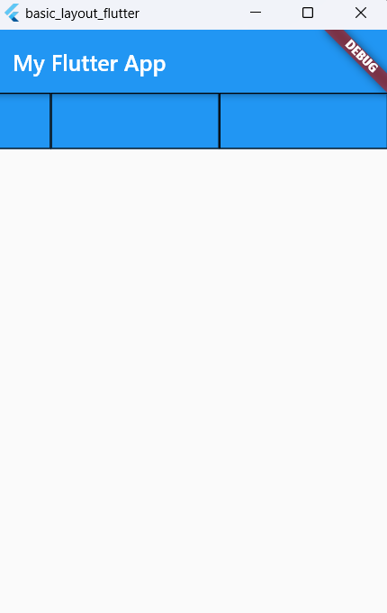

### Expanded Widget
1. Membuat file dart baru di dalam folder widget dengan nama expanded.dart
2. Menambahkan kode program pada file expanded.dart
3. Melakukan import serta memanggil function 4. ExpandedWidget di dalam function MyApp yang terletak pada main.
Hasil Run:
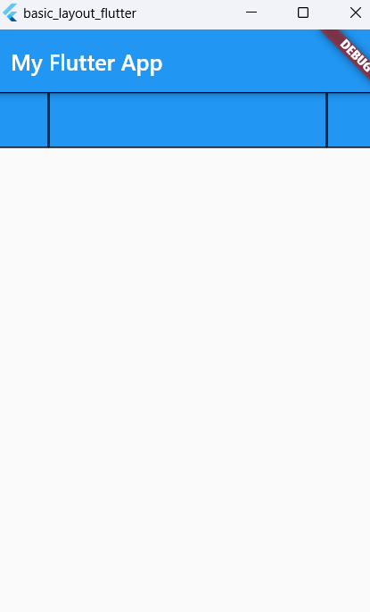

### SizedBox Widget
1. Membuat file dart baru di dalam folder widget dengan nama sized_box.dart
2. Menambahkan kode program pada file sized_box.dart
3. Melakukan import serta memanggil function SizedBoxWidget di dalam function MyApp yang terletak pada main.
Hasil Run :
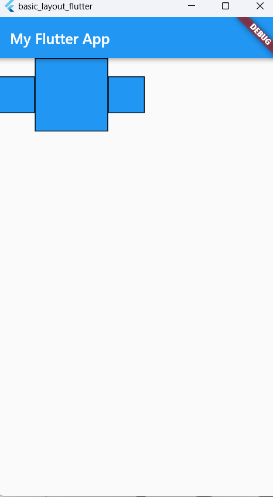

### SizedBox Widget
1. Membuat file dart baru di dalam folder widget dengan nama spacer.dart
2. Menambahkan kode program pada file spacer.dart
3. Melakukan import serta memanggil function SpacerWidget di dalam function MyApp yang terletak pada main.
Hasil Run :
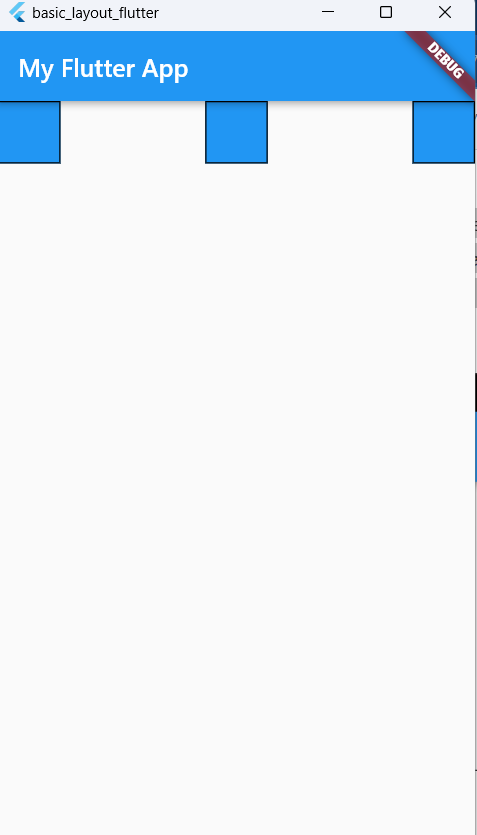

### Text Widget
1. Membuat file dart baru di dalam folder widget dengan nama text.dart
2. Menambahkan kode program pada file text.dart
3. Melakukan import serta memanggil function 4. TextWidget di dalam function MyApp yang terletak pada main.
Hasil Run :
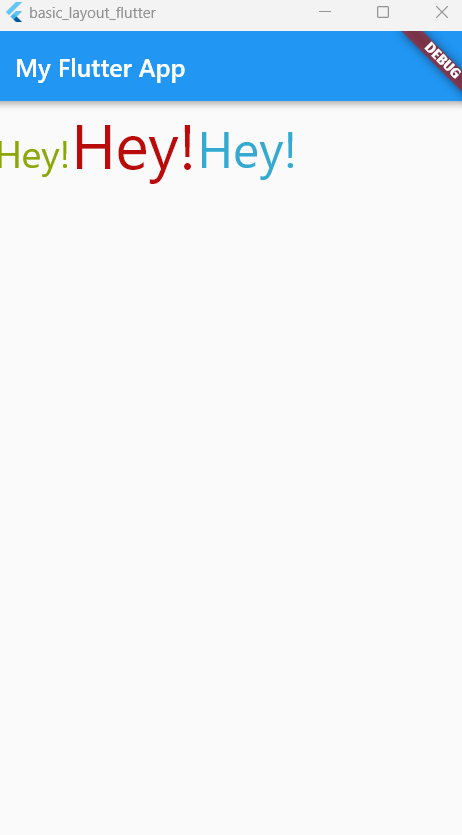

### Icon Widget
1. Membuat file dart baru di dalam folder widget dengan nama icon.dart
2. Menambahkan kode program pada file icon.dart
3. Melakukan import serta memanggil function IconWidget di dalam function MyApp yang terletak pada main.
Hasil Run :
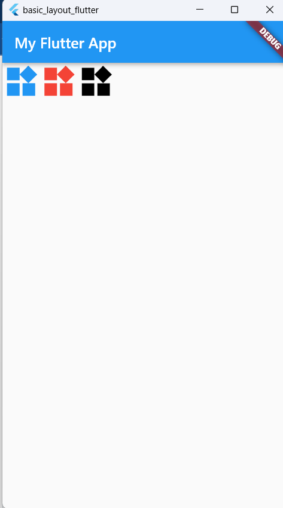

### Image Widget
1. Membuat file dart baru di dalam folder widget dengan nama image.dart
2. Menambahkan kode program pada file image.dart
3. Melakukan import serta memanggil function ImageWidget di dalam function MyApp yang terletak pada main.

### Put it All Together
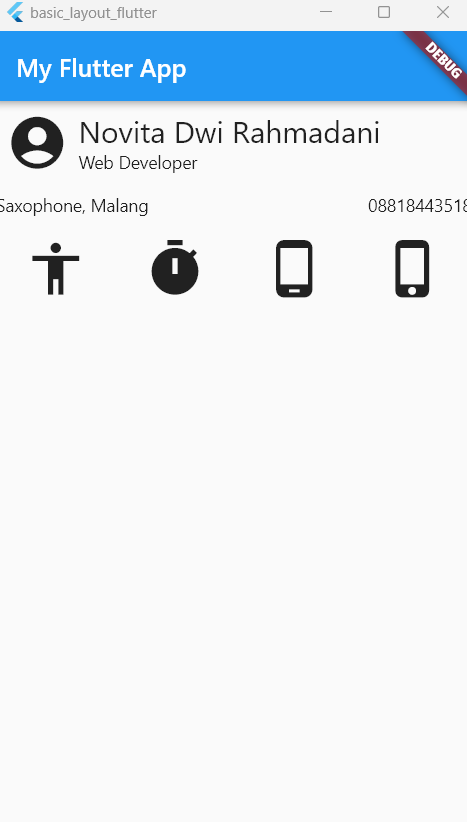
